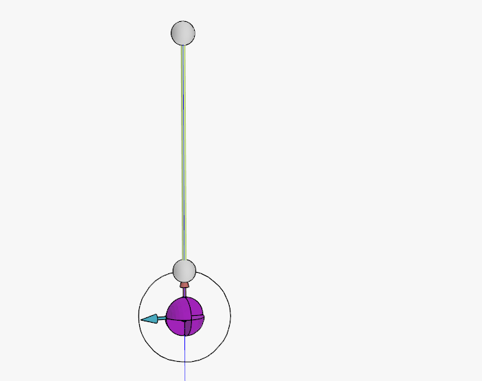

# Basic test example

Automated tests can be written in markdown.


## Model:

This is a screenshot of the model:



It is loaded by specifying a `load` section:

```load
pendulum.dave
```


- The cable has a length of 5m and a stiffness of 10000 kN
- The body has a mass of 10t

The expected load in the cable is 10 * g = 98.1 kN

The expected stretch in the cable is F * L / EA = $10t \cdot 9.81 \cdot 5m / EA = 0.049m$

Note that by default $g = 9.80665 $


## Run

In this case we run statics by specifying some code:

```actions
s.solve_statics()
```


Finally the result is asserted using an assert section

## Tests

Tests are specified using a `assert` section. This section is expected to contain blocks of value=..., expect=... and a description.

The description may span multiple lines and is markdown.

- If tol is provided then this is used as an absolute tolerance.

- If no expected value is given then the expression behind value shall evaluate to `True`

```assert
value = s['Cable'].stretch
expected = 0.049
The expected stretch in the cable is F * L / EA = $10t \cdot 9.81 \cdot 5m / EA = 0.049m$

value = s['Body'].gz
expected = 3.951
Expected vertical position of the origin of the body. The liftpoint on the body is located at x=1 and the hook in the world is at z=10. So this is 10-5-1-stretch

value = s['Body'].ux
expected = (0,0,1)
tol = 1e-3
The body will rotate such that its local X-vector points upwards

value = s.verify_equilibrium()
Should yield true
```

