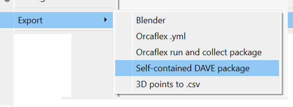

# Package example

## Model:

We can load .zip files that were exported using the self-contained export option:



```load
demo.dave.zip
```


## Run

In this case we run statics by specifying some code:

```actions
s.solve_statics()
```

Finally the result is asserted using an assert section

## Tests

Tests are specified using a `assert` section. This section is expected to contain blocks of value=..., expect=... and a description.

The description may span multiple lines and is markdown.

- If tol is provided then this is used as an absolute tolerance.

- If no expected value is given then the expression behind value shall evaluate to `True`

```assert
value = s['Visual'].parent
expected = s['Frame']
Expected parent of the visual

```

